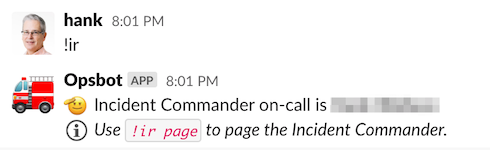
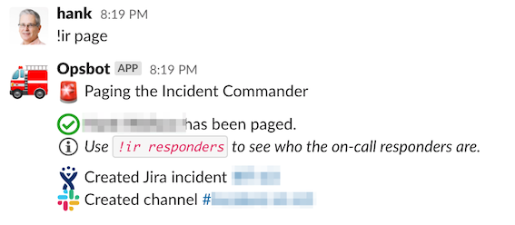
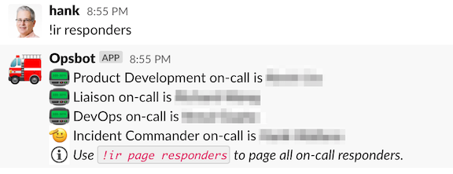
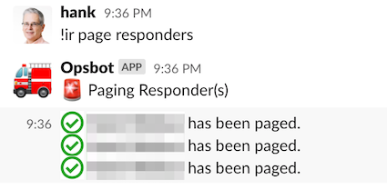
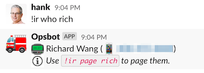
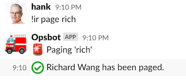

Throughout this documentation, references are made to various chat commands. Incident response actions use Slack slash commands (e.g. `/ir page`), handled by our incident response bot. This page gives an overview of the commands we've referenced in this documentation, and what they do behind the scenes.

## Incident Response

Our `/ir` commands poll the OpsGenie API behind the scenes for various on-call schedules we specify. It caches the names and contact details for the current on-call users, so that if there's any issue in making API requests, the funtionality isn't impacted.

### `/ir`
This command lists out the current Incident Commander(s) on-call, their phone numbers, and a message telling users how to page them.

### `/ir page`
This is the command we use to manually trigger our incident response process. It will page the current Incident Commander(s) on-call (the primary, the backup, and any trainees who are shadowing). It will also create a new incident in Jira that will be used for reporting purposes and a new Slack channel for discussions about the incident (aka an incident war room). Links to the Jira incident and new Slack channel will be displayed in the channel where the command was entered.

If for any reason we are unable to page the Incident Commanders automatically, the bot will let us know that it has failed, and give us the phone numbers for the relevant people so we can manually call them. Here is some example output from our test bot, where we have simulated being unable to page via OpsGenie due to an unresponsive API call.

### `/ir responders`
This works similarly to the `/ir` command, but it uses all of the team schedules instead of just the Incident Commander schedules. It will list out all the current people who are on-call for each team. This is useful to also know who will likely be joining the incident call momentarily.

### `/ir page responders`
This works similarly to `/ir page`, but it pages all of the team responders instead of the Incident Commander(s). This is rarely used, since generally only the relevant team will get paged. However, sometimes we require an "all hands on deck" response, and need the ability to quickly page all the current on-calls.

### `/ir who <target>`
If `<target>` is a team name, this lists that team's current on-call. Otherwise it's treated as a user search — it lists the contact info for the matched person, along with a message telling users how to page them.

### `/ir page <user>`
This will page a specific person by username.

